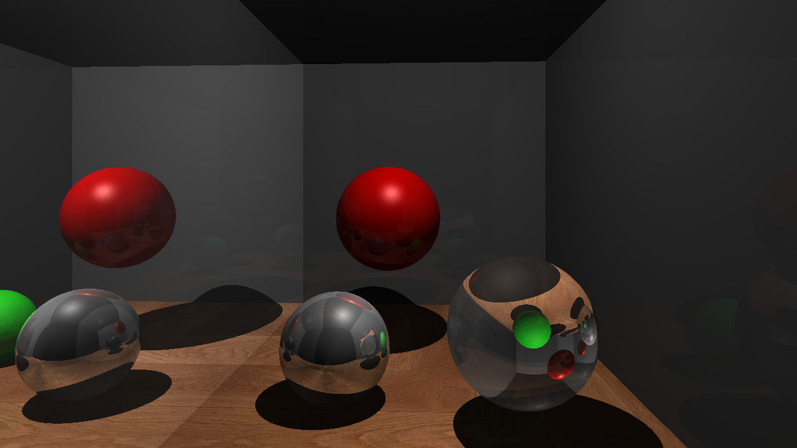
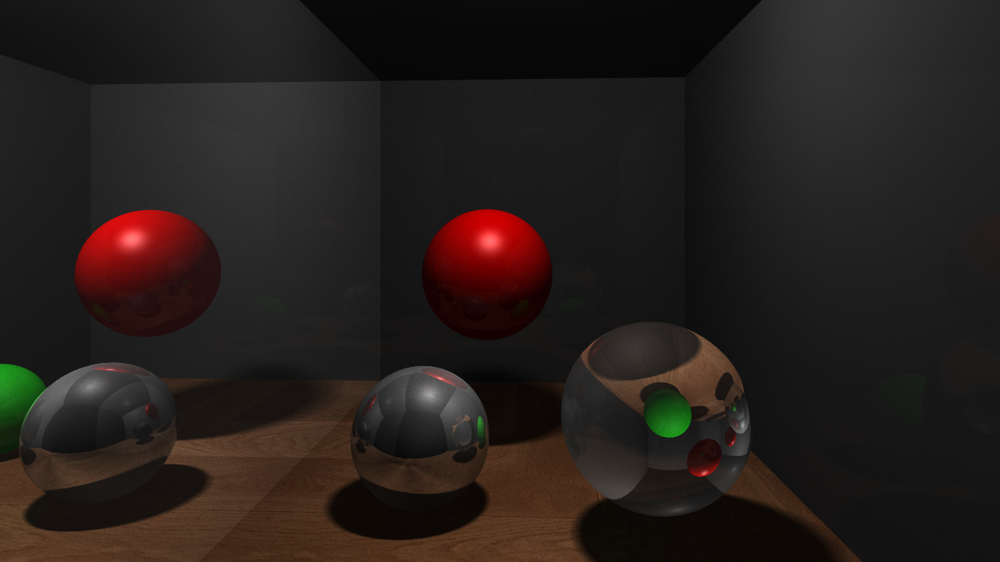
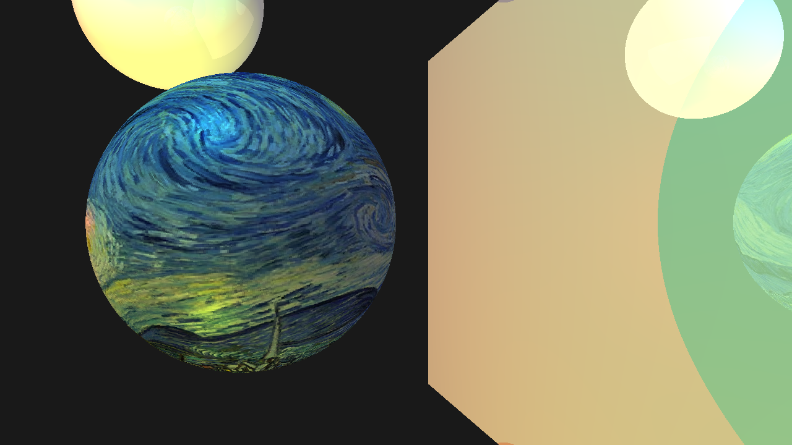
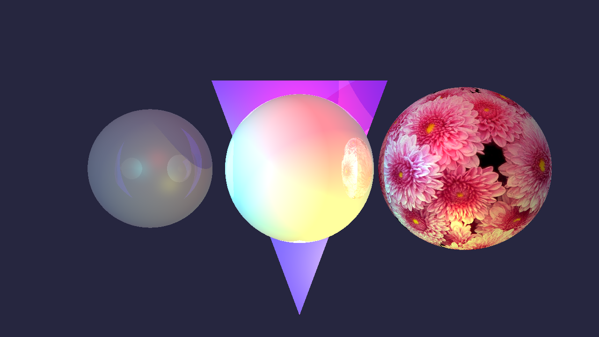

# Ray Tracer

## Table of Contents
- [Summary](#summary)
- [Code](#code)
- [Results](#results)

## Summary
This project is the culmination of two separate projects. The first part was just the implementation of ray tracing for a computer graphics class. The second part was for testing OpenMP workloads and add more features to the ray tracer as part of a parallel processing class. This ray tracer features recursive reflection and refraction, triangle and sphere intersecting, anti-aliasing, and soft shadows.

#### Instructions to run:
- Build with CMAKE using the [CMakeList](./Ray_Tracer_OpenMP/PA3_Starter/CMakeLists.txt) file
- Open in Visual Studio
- Set [Project_3](./Ray_Tracer_OpenMP/PA3_Starter/Project_3/) as startup project
- Change the input scene file to one of the [Sample Scenes](./Ray_Tracer_OpenMP/PA3_Starter/Project_3/Media/SampleScenes/) .ray files on line 40 of [Project3.cpp](./Ray_Tracer_OpenMP/PA3_Starter/Project_3/Sources/Project3.cpp)
- Run through Visual Studio

	or

- Run the [Sample Executable](./Ray_Tracer_OpenMP/PA3_Starter/Build/Project_3.exe)

## Code
Source code can be found here: [Code](./Ray_Tracer_OpenMP/PA3_Starter/Project_3/Sources/)

Since this was a class project. Most of this project is starter code. The actual implementation of ray tracing was my task for part on of the project. Below are all of the change and implementation made by me. Deeper explanations on my ray tracing algorithm can be found in my [Report](./Report/final_project_report.pdf) in the "Background" section.

Implementations made:
- [Project3.cpp](./Ray_Tracer_OpenMP/PA3_Starter/Project_3/Sources/Project3.cpp)
	- lines 191-240:
		- for each pixel:
			- calculate the direction through the pixel
			- call rayTrace
			- take multiple samples per pixels
			- add pixel color to frame buffer for rendering
	- lines 11,23-35,316-317:
		- animation loop (currently not in use)
- [scene.cpp](./Ray_Tracer_OpenMP/PA3_Starter/Project_3/Sources/scene.cpp)
	- lines 15-162:
		- rayTrace algorithm
		- lighting (ambient, diffuse, specular)
		- recursive reflection and refraction
	- lines 249-255:
		- camera movement for animation (currently not in use)
	- lines 360-367:
		- sphere movement for animation (currently not in use)
- [sphere.cpp](./Ray_Tracer_OpenMP/PA3_Starter/Project_3/Sources/sphere.cpp)
	- lines 18-48:
		- sphere testIntersection implemented
	- line 56-61:
		- normal calculated
	- lines 66-100:
		- sphere texture coordinates implemented
	- lines 92-96:
		- texture rotation for animation (currently not in use)
- [triangle.cpp:](./Ray_Tracer_OpenMP/PA3_Starter/Project_3/Sources/triangle.cpp)
	- lines 26-65:
		- triangle testIntersection implemented
	- lines 86-109:
		- triangle texture coordinates implemented

## Results
All images can be found here: [Images](./Results/)

The report on parallel processing can be found here: [Report](./Report/final_project_report.pdf)

### Images:

Notice the difference in the edge aliasing and shadows of the first two images

1 samples per pixel and 1 shadow ray per light source
   

16 samples per pixel and 16 shadow rays per light source
   

Video animation of this scene can be found [here](./Results/my_animation.mp4) (GitHub won't embed the mp4)
   

<!---
<video width="1000" controls>
  <source src="./Results/my_animation.mp4" type="video/mp4">
</video>

Animated video made up of [individually rendered frames](./Results/AnimationImages/)
   
-->

Scene with multiple colored light sources and a textured wrapped object